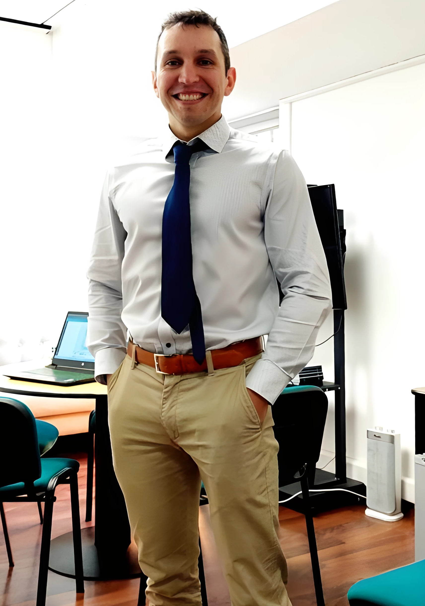

```{css, echo=FALSE}
.pagedjs_page:not(:first-of-type) {
  background: white;
}

.pagedjs_page:not(:first-of-type) {
  --sidebar-width: 0rem;
  --sidebar-background-color: #ffffff;
  --main-width: calc(var(--content-width) - var(--sidebar-width));
  --decorator-horizontal-margin: 0.2in;
}
```


# Aside

{width="100%"}

## Información de contacto {#contact}

-   <i class="fa fa-envelope"></i> [matias.yanez\@ufrontera.cl](mailto:matias.yanez@ufrontera.cl){.email}
-   <i class="fa fa-phone"></i> +56 966020096
-   <i class="fa-brands fa-linkedin-in"></i> [Linkedin](https://www.linkedin.com/in/matiasyp/)


## Disclaimer {#disclaimer}

Última actualización 01/12/2024.

# Main

## Mg. Matías Yáñez Pohl {#title}

### Actualmente buscando trabajo como Analista de Datos

::: {style="text-align: justify;"}
Ingeniero analista de datos para la Universidad de La Frontera, con experiencia en educación y evaluación de impacto. He aplicado la analítica de aprendizaje para obtener insights que optimicen los procesos educativos. En mi tesis de Magíster, desarrollé un marco metodológico para evaluar la Transformación Digital en Educación Superior, utilizando indicadores basados en huellas digitales de sistemas de información. Manejo herramientas como Rstudio y Looker Studio para análisis y visualización de datos.
:::
## Experiencia profesional {data-icon="suitcase"}

### Ingeniero analista de datos

Universidad de La Frontera

Temuco, Chile

2021 - 2024

-   Diseñé e implementé instrumentos de evaluación para medir competencias digitales docentes.
-   Colaboré en la evaluación del impacto de Proyectos de Innovación Docente e iniciativas alineadas con el Modelo Educativo Institucional que dependen de la Coordinación de Desarrollo de la Docencia.
-   Realicé procesos completos de extracción, transformación y carga (ETL) de datos para análisis estadísticos avanzados.
-   Desarrollé análisis estadísticos en RStudio para los informes de evaluación de impacto.
-   Creé *dashboards* interactivos en Looker Studio, proporcionando visualizaciones personalizadas para diversas unidades, optimizando la toma de decisiones estratégicas.

### Líder técnico

Instituto de Informática Educativa

Temuco, Chile

2020 - 2021

-   Lideré un equipo técnico multidisciplinario para la creación del "Maletín Didáctico", que incluye guías, actividades interactivas y presentaciones innovadoras.
-   Coordiné con la Mesa Técnica y Pedagógica para garantizar la alineación del proyecto con los objetivos educativos nacionales.
-   Investigué competencias clave, certificaciones y tendencias del sector productivo para modernizar la especialidad de Programación en los liceos Técnico-Profesionales (TP) de Chile.
-   Diseñé y desarrollé un plan de estudios actualizado, alineado con estándares internacionales y las necesidades del mercado laboral.
-   Diseñé e implementé un [plan de formación docente](https://www.curriculumnacional.cl/portal/Educacion-Tecnico-Profesional/Tecnologia-y-Comunicaciones/Especialidad-Programacion/#tabs_2){target="_blank"} para asegurar la correcta aplicación del plan de estudios modernizado.
-   Transferí el proyecto a más de 100 docentes, promoviendo prácticas innovadoras en la enseñanza de programación.


### Game Designer

Paperseed

Viña del Mar, Chile

2017 - 2019

-   Lideré equipos multidisciplinarios en la creación y ejecución de videojuegos hipercasuales para Android, optimizando la experiencia del usuario mediante análisis de datos.
-   Diseñé y desarrollé videojuegos y experiencias inmersivas en VR/AR utilizando Unity, aplicando metodologías ágiles como Scrum y Kanban.
-   Publicación y comercialización de videojuegos en tiendas de aplicaciones, logrando posicionamiento en nichos específicos del mercado móvil.


## Experiencia en Docencia {data-icon="chalkboard-teacher"}

### Pruebas de software.

N/A 

Universidad de La Frontera

2023

Docente asistente de la asignatura ICC-735 enfocada en conceptos, métodos y técnicas utilizadas para garantizar la calidad del software.

### De la Idea al Juego: Taller de Creación de Videojuegos.

N/A

Universidad de La Frontera

2024

Docente responsable del electivo ICC-165, orientado al diseño, producción y pre-producción de videojuegos.

### Acceso a datos

N/A 

Universidad de La Frontera

2024

Docente responsable de la asignatura ICC-704, centrada en scripting de SQL, integrando teoría y práctica en el manejo de sistemas de gestión de bases de datos.


## Formación {data-icon="graduation-cap" data-concise="true"}

### Universidad de La Frontera

Magíster en Ingeniería Informática

Temuco, Chile

2024

Titulado con distinción máxima con la tesis "Indicadores observables para la evaluación de la Transformación Digital en Educación Superior".

### Universidad Técnica Federico Santa María

Ingeniero en Ejecución Informática

Valparaiso, Chile

2017

Titulado con distinción máxima con la memoria "Diseño y desarrollo de videojuego hiper-casual en Unity para la plataforma Android".

## Proyectos {data-icon="chart-gantt"}

### EXT23-0012 Inteligencia Artifcial en el aula: De la defnición a la acción.

N/A

N/A

2023

Proyecto de Vinculación con el Medio

### DID22-0021 Detección y evaluación de perfles competenciales en la formación psicológica mediante la gamificación.

N/A

Universidad de La Frontera

2022

Proyecto de Innovación Docente

### EXT21-0038 Hacia un nuevo enfoque en la Enseñanza de las Ciencias en contexto remoto. Integración entre las metodologías lúdica e indagatoria.

N/A

N/A

2023

Proyecto de Vinculación con el Medio

## Publicaciones y congresos {data-icon="file"}

### Observable indicators for assessing digital transformation in higher education.

Developments and Advances in Defense and Security, MICRADS 2024. Springer. To appear.

N/A

2024

Presentación en *International Conference on Information Technology & Systems*.

**Yañez-Pohl, M.** and Cares, C.

### Ejes y oportunidades en la medición de la transformación digital en educación superior.

Jornadas Chilenas de la Computación.

N/A

2023

Presentación en Encuentro de Tesistas de la Jornadas Chilenas de la Computación.

**Yañez-Pohl, M.** and Cares, C.

### [Videojuegos al aula: Experiencia de integración, entre gamificación y metodología indagatoria.](https://drive.google.com/file/d/1fYBGsz-1h-RvatvVC0kJ-I9i_ryriJND/view?usp=drive_link)

ISBN 978-956-236-416-4

N/A

2022

Osses Bustingorry, S., Iturriaga Niemann, A., Alvarez Gómez, P., **Yañez Pohl, M.**, Abarzúa Charnay, I., & Berckhoff Vásquez, C.

## Cursos {data-icon="leanpub"}

### Diplomado de Investigación Formativa

Universidad de La Frontera

N/A

2023

### Data Analyst with R

Datacamp

N/A

2021

### Full Stack Java Trainee

Talento Digital para Chile

N/A

2021


